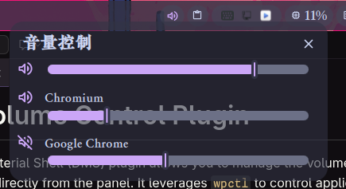

# App Volume Control Plugin

This [Dank Material Shell](https://github.com/AvengeMedia/DankMaterialShell) plugin allows you to manage the volume of individual applications directly from the panel. It leverages `wpctl` to control application audio levels.

## Features

* Control system volume with a single slider and mute/unmute toggle.
* Adjust volume for each running application independently.
* Each application has its own volume icon, name, volume slider, and mute button (click volume icon).

## How It Works

* The Python script `volumeAppInfo.py` fetches volume information for all running applications using `wpctl status -k`.
* The data is then passed to `AppVolumeControl.qml` for display and interactive control.

## Usage

1. Ensure `python` and `wpctl` are installed on your system.
2. `chmod +x volumeAppInfo.py` to make the script executable.
2. Open the App Volume Control plugin in DMS to adjust volumes.
3. Download the files and copy it in `~/.config/DankMaterialShell/plugins/AppVolumeControl` folder. The file structure should look like this:

```
$HOME/.config/DankMaterialShell
...
├── plugins
│   ├── AppVolumeControl
│   │   ├── AppVolumeControl.qml
│   │   ├── plugin.json
│   │   ├── README.md
│   │   ├── screenshot.png
│   │   └── volumeAppInfo.py
│   ├── other plugins
...
```

## Notes

* Application names are retrieved from `wpctl status -k`, which may not always reflect the actual application name. For example, a music app like `YesPlayMusic` may appear as `Chromium` (The screenshot case).
* You can change the `.qml` file to customize the appearance or functionality as needed. 
* If there are different apps with same name in `wpctl status -k`, space will be added in the end of the name to distinguish them. You still have to identify them by yourself.

## Screenshot



* The first slider controls the system volume. The 🔈 icon toggles mute/unmute.
* Subsequent sliders control individual applications. Each line displays the app icon, name, volume level, and a mute button.
